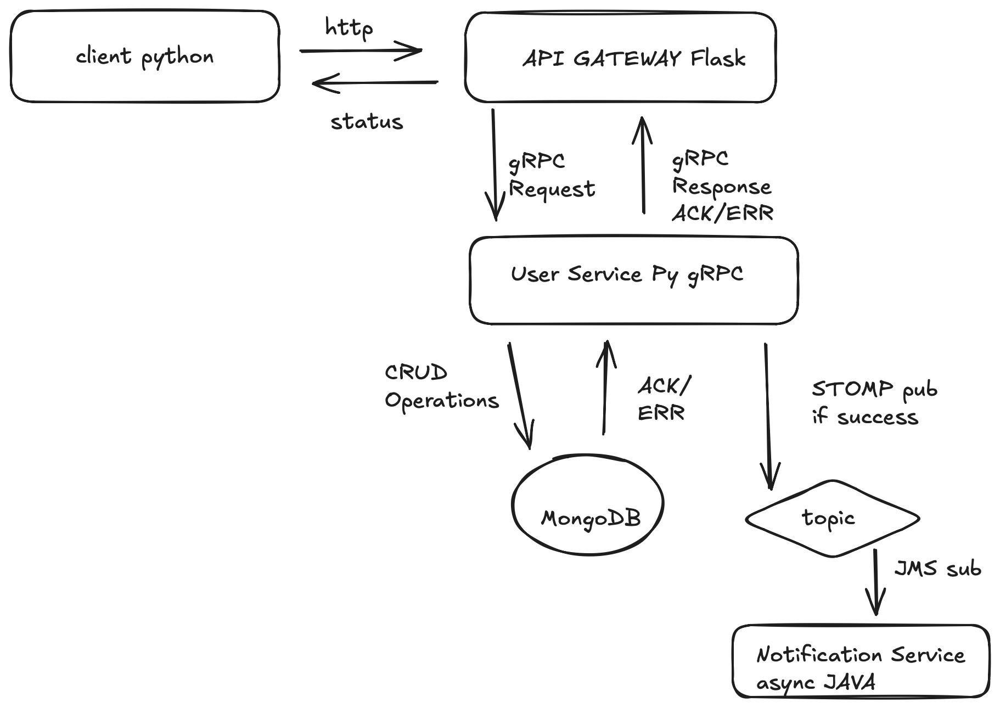

# Distributed Microservices User Management System

A robust, containerized microservices architecture for managing user accounts and asynchronous notifications. 

Built as a proof-of-concept to demonstrate modern backend patterns, this project integrates heterogeneous technologies:
* **Python & Java**
* **Flask & gRPC**
* **REST APIs & MongoDB**
* **Message Brokers (STOMP/JMS)**
* **Fully orchestrated with Docker**

## Architecture Overview

The system is designed with scalability and decoupling in mind. The architecture consists of the following isolated components:

* **Test Client (Python):** Simulates external HTTP requests to interact with the system.
* **API Gateway (Python/Flask):** The single entry point for external REST/HTTP calls. It routes traffic and translates HTTP requests into gRPC calls for internal services.
* **User Service (Python/gRPC):** The core business logic service. It handles high-performance gRPC requests from the Gateway, performs CRUD operations, and manages data persistence.
* **Database (MongoDB):** A NoSQL database used by the User Service to store user documents.
* **Message Broker (Topic):** Handles asynchronous event-driven communication. Whenever a user is successfully created, an event is published here.
* **Notification Service (Java):** An independent background service acting as a subscriber. It listens to the message broker topic to trigger post-creation workflows.



## Design Decisions

### Why an API Gateway?

The API Gateway acts as the single entry point for external clients.  
It decouples the public HTTP interface from the internal service architecture and allows internal services to evolve without exposing their implementation details.

### Why gRPC for internal communication?

gRPC is used for service-to-service communication because of its high performance and efficient binary serialization through Protocol Buffers.  
It also provides strongly typed contracts between services, making the communication layer more reliable and maintainable.

### Why asynchronous notifications?

User creation can trigger additional workflows such as sending notifications.  
By publishing an event to a message broker, the system avoids blocking the main request flow and allows other services to react independently in an event-driven manner.

### Why polyglot services?

The system intentionally uses both Python and Java services to demonstrate how heterogeneous microservices can communicate using standardized protocols and messaging systems.  
This reflects real-world architectures where services are often implemented using different technologies.

## How It Works

The data flow is designed to be fast and non-blocking:

1. The **Client** sends a standard HTTP request to the **API Gateway**.
2. The Gateway translates the HTTP call into a high-speed gRPC request and forwards it to the **User Service**.
3. The User Service processes the logic and interacts with **MongoDB** (e.g., inserting a new user).
4. Upon successful user creation, the User Service publishes a message to the **Message Broker** via STOMP.
5. The **Notification Service** (Java) asynchronously receives the message via JMS and simulates sending a welcome notification, without blocking the main user request.

## Live Demo

Below is a real-time demonstration of the test client executing CRUD operations, alongside the live Docker logs showing the microservices communicating and the database updating:

[https://github.com/user-attachments/assets/eac232f8-6d4d-426f-8ea3-f204225d0312](https://github.com/user-attachments/assets/eac232f8-6d4d-426f-8ea3-f204225d0312)

## Prerequisites

Since the entire microservices ecosystem is containerized, the only requirements to run this project locally are:
* **Docker**
* **Docker Compose**

## Setup and Execution

1. **Clone the repository:**
   ```bash
   git clone https://github.com/gioincoronato/Microservice-Distributed-Users-Managment-System.git
   cd Microservice-Distributed-Users-Managment-System
   ```

2. **Build and start the microservices:**
   Bring up the API Gateway, User Service, Notification Service, MongoDB, and the Message Broker all at once using Docker Compose:
   ```bash
   docker-compose up --build
   ```
   *Note: Wait a few moments for all containers to initialize and for the database and message broker to be ready to accept connections.*

3. **Run the test client:**
   Once the infrastructure is up and running, you can execute the Python test client to simulate traffic and see the microservices in action. Open a new terminal window and run:
   ```bash
   python test_client/client.py
   ```
   You will see the logs in your Docker terminal updating in real-time as the HTTP requests are translated into gRPC calls, data is saved to MongoDB, and asynchronous notifications are triggered.

4. **Stop the environment:**
   To cleanly shut down all containers and remove the created networks:
   ```bash
   docker-compose down
   ```
